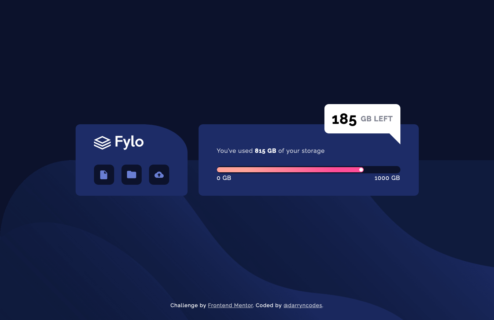
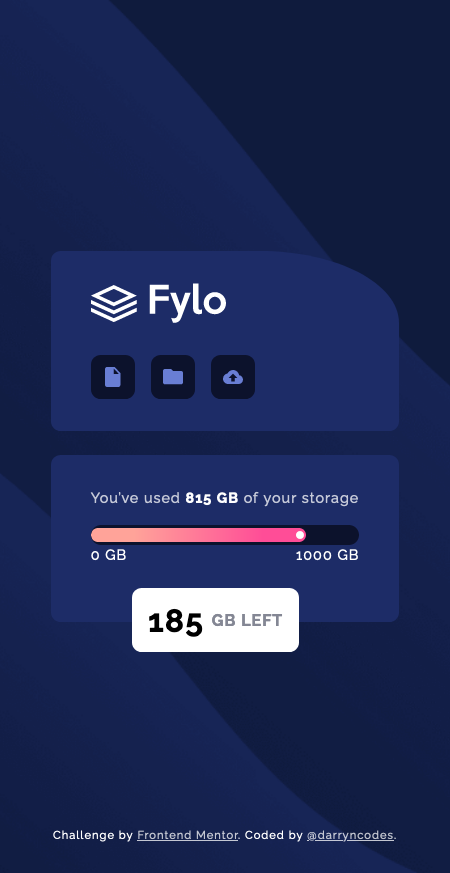

# Frontend Mentor - Fylo data storage component solution

This is a solution to the [Fylo data storage component challenge on Frontend Mentor](https://www.frontendmentor.io/challenges/fylo-data-storage-component-1dZPRbV5n). Frontend Mentor challenges help you improve your coding skills by building realistic projects.

## Table of contents

-   [Overview](#overview)
    -   [The challenge](#the-challenge)
    -   [Screenshot](#screenshot)
    -   [Links](#links)
-   [My process](#my-process)
    -   [Built with](#built-with)
    -   [What I learned](#what-i-learned)
    -   [Continued development](#continued-development)
    -   [Useful resources](#useful-resources)
-   [Author](#author)

## Overview

### The challenge

Users should be able to:

-   View the optimal layout for the site depending on their device's screen size

### Screenshot

### Links

-   [GitHub repo](https://github.com/darryncodes/fylo-data-storage-component)
-   [Solution URL](https://darryncodes.github.io/fylo-data-storage-component/)

## My process

### Built with

-   Semantic HTML5 markup
-   CSS custom properties
-   SCSS
-   JS
-   Flexbox
-   Mobile-first workflow
-   BEM methodology

### What I learned

I used this challenge to learn more abbout accessibility. I focused on using the correct semantic mark up, custom focus states, aria-label and ensured I removed all animations, transitions and smooth scroll for people that prefer not to see them.

-   [When to use aria-label](https://developer.mozilla.org/en-US/docs/Web/Accessibility/ARIA/Attributes/aria-label)

### Continued development

-   I'd like to really delve into accessibility and make sure it's a fundamental part of my process.

### Useful resources

-   [MDN - <meter>: The HTML Meter element](https://developer.mozilla.org/en-US/docs/Web/HTML/Element/meter)
-   [MDN - Using CSS animations](https://developer.mozilla.org/en-US/docs/Web/CSS/CSS_Animations/Using_CSS_animations)

## Author

-   Work in progress portfolio site - [@darryncodes](https://www.darryncodes.co.uk/)
-   Frontend Mentor - [@darryncodes](https://www.frontendmentor.io/profile/darryncodes)
-   Twitter - [@darryncodes](https://twitter.com/darryncodes)
